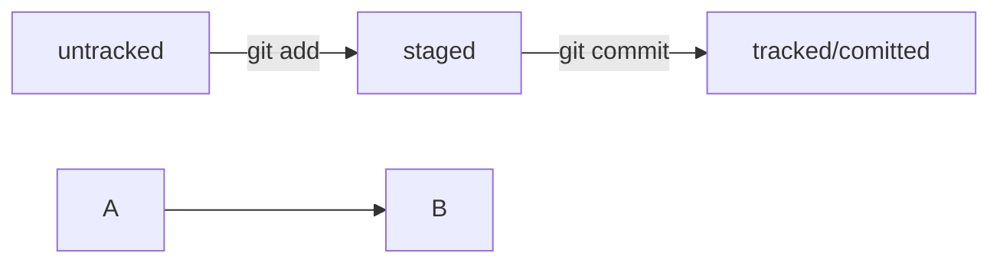

# Справка по командам Git

**Оглавление**
- [Справка по командам Git](#справка-по-командам-git)
  - [Настройки Git](#настройки-git)
    - [Файл `.gitignore`](#файл-gitignore)
    - [Создание собственных команд (alias)](#создание-собственных-команд-alias)
  - [Создание и удаление репозитория](#создание-и-удаление-репозитория)
    - [Подключение к существующему репозиторию по ссылке](#подключение-к-существующему-репозиторию-по-ссылке)
    - [Перенос локального проекта в репозиторий](#перенос-локального-проекта-в-репозиторий)
    - [Удаление локального репозитория](#удаление-локального-репозитория)
    - [Fork (форк) репозитория](#fork-форк-репозитория)
  - [Просмотр изменений](#просмотр-изменений)
    - [Просмотр измененных файлов в локальном репозитории](#просмотр-измененных-файлов-в-локальном-репозитории)
    - [Просмотр изменений в файлах](#просмотр-изменений-в-файлах)
    - [Просмотр истории изменений репозитория](#просмотр-истории-изменений-репозитория)
  - [Создание SSH-ключей](#создание-ssh-ключей)
  - [Работа с удаленным репозиторием](#работа-с-удаленным-репозиторием)
    - [Привязка удаленного репозитория к локальному](#привязка-удаленного-репозитория-к-локальному)
    - [Отправка изменений в удаленный репозиторий](#отправка-изменений-в-удаленный-репозиторий)
    - [Скачивание изменений из удаленного репозитория](#скачивание-изменений-из-удаленного-репозитория)
  - [Работа с ветками репозитория](#работа-с-ветками-репозитория)
    - [Просмотр веток](#просмотр-веток)
    - [Создание веток](#создание-веток)
    - [Переключение между ветками репозитория](#переключение-между-ветками-репозитория)
    - [Переименование ветки в локальном репозитории](#переименование-ветки-в-локальном-репозитории)
    - [Удаление веток](#удаление-веток)
    - [Слияние веток](#слияние-веток)
    - [Устранение конфликтов влияния веток](#устранение-конфликтов-влияния-веток)
  - [Пул-реквест (pull request)](#пул-реквест-pull-request)
  - [Разное](#разное)
    - [`git stash`](#git-stash)

На локальном компьютере должен быть установлена программа Git. Команды можно давать в любой командной строке или в специализированной командной строке `Bash`, которая устанавливается в комплекте с Git.

**Терминология**

- *index* — область зафиксированных изменений, т.е. всё то, что подготовлено к сохранению в репозиторий.
- *commit* — изменения, отправленные в репозиторий.
- *HEAD* — указатель/метка на commit (коммит), в котором находимся.
- *tag* — указатель/метка на commit (коммит), чтобы выделить/отметить его для отличия от остальных,  
  устанавливается в текущем месте командой `git tab имя_метки`,  
  переход на тэг командой `git checkout имя_метки`.
- *main* (*master*) — имя ветки по-умолчанию, а также указатель на определённый коммит.
- *origin* — имя/признак удалённого репозитория по умолчанию (можно дать другое),  
  например: `main` - ветка в локальном репозитории, а `origin main` - эта же ветка в удаленном репозитории.
- *checkout* — взять из репозитория какое-либо его состояние.

[Учебник по Git](https://githowto.com/ru).


## [Настройки Git](#справка-по-командам-git)

После установки и перед началом работы с Git нужно указать в конфиге своё имя и email, чтобы корректно отображалось в истории изменений:
```bash
$ git config --global user.name "имя_пользователя"
$ git config --global user.email адрес_электронной_почты
```

- параметры установки окончаний строк:
```bash
$ git config --global core.autocrlf true
$ git config --global core.safecrlf warn
```

- отображения unicode для устранения нечитаемости строк:
```bash
$ git config --global core.quotepath off
```

- изменить название ветки по умолчанию (по умолчанию установлен master):
```bash
$ git config --global init.defaultBranch main
```

Просмотр настроек Git (из всех настроечных файлов):
```bash
$ git config --list --show-origin
```

Про настройки Git можно почитать в [документации по Git](https://git-scm.com/book/ru/v2/%D0%9D%D0%B0%D1%81%D1%82%D1%80%D0%BE%D0%B9%D0%BA%D0%B0-Git-%D0%9A%D0%BE%D0%BD%D1%84%D0%B8%D0%B3%D1%83%D1%80%D0%B0%D1%86%D0%B8%D1%8F-Git).


### [Файл `.gitignore`](#справка-по-командам-git)

Текстовый файл в корневом каталоге репозитория, в котором прописаны папки и файлы, которые git не должен отслеживать.  
Сам файл `.gitignore` Git должен отслеживать.

Правила оформления записей в файле `.gitignore`:
- `#` - комментарии;
- `*` - любая строка, включая пустую;
- `?` - соответствует одному любому символу;
- `[...]` - соответствуют одному символу из перечисленных или заданных диапазоном внутри скобок;
- `/` - указывает на каталоги, слэш в начале - файлы или каталоги только в корневой директории, слэш в конце имени папки - правило применяется только к этой папке;
- `**` - любое количество вложенных папок, в том числе ноль;
- `!` - инвертирование, для добавления исключений.


### [Создание собственных команд (alias)](#справка-по-командам-git)

Реализуется через создание переменных `alias` в конфигурационном файле, содержащих наборы команд Git.

- Пример создания команды, которая: выводит статус репозитория, добавляет все файлы, делает коммит, выполняет пуш в ветку main удаленного репозитория и снова выводит статус репозитория:

  `$ git config --global --add alias.acp '!git status && git add --all && git commit -m "$1" && git push origin main && git status'`

  Вызов созданной команды:  
  `git acp "Добавлены решения, откорректировано оформление"`

  , где:
  - `--global` - показывает, что команда (alias) добавляется в глобальный конфигурационный файл;
  - `--add alias.acp` - добавление новой команды с именем `acp`;
  - `!` - указывает, что это команда оболочки.

  - `--replace-all` - изменение существующей команды
  - `--unset` - удаление существующей команды

- Пример создания команды `ehw`, которая выполняет функцию `fn` с набором команд, записанную в файле `.my_functions`:

  `$ git config --global --add alias.ehw $'!bash -c \'source /etc/.my_functions && fn\''`

  , где:
  - `source` - команда открытия указанного файла по указанному пути;
  - `fn` - запуск функции в открытом файле;
  - `\'` - внутренние кавычки экранированы обратным слэшем;
  - `$` - нужен для корректной передачи строки с bash командами (для исключения ошибки `bash: syntax error near unexpected token '}'`);
  - содержимое файла `.my_functions`:  
  ```text
  fn() {
      echo "Hello, world!"
  }
  ```

- Пример создания команды `hw` с передаваемым ей параметром (`$1`) через ручное создание переменной в конфигурационном файле (в `gitconfig` прописываются следующие строки):
  ```text
  [alias]
    hw = "!f(){ echo \"Hello World!\"; echo \"My name is $1. And I'm developer\"; };f "
  ```
  вызов созданной команды:  
  `$ git hw "Иван"`

  результат:  
  `Hello World!`  
  `My name is Иван. And I'm developer`

- Просмотр всех созданных команд по ключевому слову `alias` с помощью регулярного выражения:

  `$ git config --get-regexp '^alias\.'`


## [Создание и удаление репозитория](#справка-по-командам-git)

Не рекомендуется создавать репозиторий Git внутри другого Git-репозитория. Это может вызывать проблемы с отслеживанием изменений.


### [Подключение к существующему репозиторию по ссылке](#справка-по-командам-git)

Перейти на локальном компьютере в нужную папку и выполнить команду `git clone`. По умолчанию будет создана папка с названием репозитория. Одноименные ветки удаленного и локального репозиториев сразу будут связаны между собой.
```bash
$ git clone https://github.com/yazon315/Seekers-OCR.git
```

Если создаваемой папке нужно дать другое имя, отличное от названия репозитория, (в данном случае `OCR`) то надо его указать:
```bash
$ git clone https://github.com/yazon315/Seekers-OCR.git OCR
```

`git clone ссылка_на_репозиторий путь_к_папке` - клонирование репозитория в конкретную папку на локальном компьютере.

`git clone -branch имя_ветки ссылка_на_репозиторий` - клонирование конкретной ветки репозитория.


### [Перенос локального проекта в репозиторий](#справка-по-командам-git)

- Создать на Github репозиторий с названием локального проекта - папки в которой проект находится на локальном компьютере (в данном примере `Seekers-OCR`). Названия могут отличаться, но если будут совпадать, то будет меньше путаницы.
- Перейти в папаку с проектом на локальном компьютере (в данном примере в `Seekers-OCR`) и выполнить следующие команды:
    
    ```bash
    $ git init
    $ git add .
    $ git commit -m "Initial commit"
    $ git remote add origin https://github.com/yazon315/Seekers-OCR.git
    $ git push -u origin main
    ```
    *Расшифровка используемых команд*:
- `git init` - инициализация репозитория в текущей папке;
- `git add` - перевод файлов в список подготовленных для системы git (`.` - всех файлов в папке или указать названия конкретных файлов);
- `git add --all` - перевод всех файлов в репозитории в состояние подготовленных;
- `git add -am "комментарий"` - внесение изменений во все отслеживаемые вайлы и коммитом.
- `git restore --staged имя_файла` - убрать файл из списка подготовленных (`.` - все файлы в папке);
- `git reset` - исключение файлов из подготовленных (аналогично `.` - всех файлов в папке / названия конкретных файлов);
- `git mv старое_имя новое_имя` - переименование подготовленного файла в репозитории;
- `git rm имя` - удаление подготовленного файла в репозитории;
- `git commit` - включение изменений из подготовленных файлов в репозиторий (git commit выполнится только для подготовленных (после git add) файлов!):
  - `-m` - атрибут для добавления комментария/пояснения (`"Initial commit"` - обычное название первого комментария в проекте);
- `git commit --amend --no-edit` - внесение изменений в последний (HEAD) коммит без изменения его описания;
- `git commit --amend -m "новый_текст_коммита"` - внесение изменений в последний (HEAD) коммит с заменой его описания;
- `git resert хэш` - откат последних изменений (коммитов), указывается хэш коммита до которого надо откатить изменения, откроется редактор для внесения содержания комментария отмены:
  - `git resert --no-edit хэш` - откат последних изменений без комментариев/пояснений;
  - `git reset --hard хэш` - откат до указанного хэшем коммита (более поздние коммиты исчезнут);
- `git restore имя_файла` - откат изменений в файле до последней сохраненной в коммите версии;
- `git remote add` -  подключение к уделенному, ранее созданному репозиторию на Github (`origin https://github.com/yazon315/Seekers-OCR.git`);
- `git remote rm origin` - удаление привязки к удаленному репозиторию;
- `git push` - отправка включенных (откоммиченных) файлов в удаленный репозиторий:
  - `-u origin main` - осуществляет первичную привязку одноименных веток в локальном и удаленном репозитории, устанавливается при первом `git push` ветки;
  - `-u origin --all` - первичная привязка всех веток.


### [Удаление локального репозитория](#справка-по-командам-git)

Перейти в папку с локальным репозиторием и выполнить команду:
```bash
$ rm -rf .git
```
`-r` - удаление папок вместе с их содержимым;  
`-f` - принудительное удаление без уточняющих вопросов.


### [Fork (форк) репозитория](#справка-по-командам-git)

С любого репозитория на Github можно сделать полную копию в свой аккаунт на Github. Копия будет независима от исходного репозитория и автономна и при этом содержать всю информацию из исходного репозитория.  
Во время форка можно выбрать копирование только основной ветки main.

Форк выполняется в графическом интерфейсе Github, нажатием кнопки `Fork` в ропозитории, с которого делается копия.

Этот метод применяется при доработке чужих проектов. После форка, удаленный репозиторий можно клонировать на локальный комьютер и работать с ним как обычно.


## [Просмотр изменений](#справка-по-командам-git)

### [Просмотр измененных файлов в локальном репозитории](#справка-по-командам-git)

```bash
$ git status
```

`git status --ignored` - просмотр статусов файлов, включая игнорируемые.

Статусы файлов в Git:
- `untracked` - неотслеживаемый;
- `staged` - подготовленный;
- `tracked` - отслеживаемый;
- `modified` - изменённый.
 

Жизненный цикл файла в Git:
1. Файл создан, Git про него не знает, состояние: `untracked`.
2. Файл добавлен в staging area (область подготовленных файлов) с помощью `git add`, состояние: `staged` (+ `tracked`).
   - Если в этот момент изменить файл, то состояние: `staged`, `modified` (+ `tracked`).  
  Внимание: `staged` и `modified` у одного файла, но у разных его версий.
   - Ещё раз выполнена команда `git add`, состояние: `staged` (+ `tracked`).
3. Сделан коммит с помощью команды `git commit`, состояние: `tracked`.
4. Изменен файл, состояние: `modified` (+ `tracked`).
5. Файл снова добавлен в staging area с помощью `git add`, состояние: `staged` (+ `tracked`).
6. Сделан коммит командой `git commit`, состояние: `tracked`.
7. Повторение пунктов 4 − 7 много раз.

*mermaid-схема:*



### [Просмотр изменений в файлах](#справка-по-командам-git)

`git diff` - во всех файлах в состоянии `modified` (измененный);

`git diff main.ipynb` - в конкретном файле (в данном примере в main.ipynb);

`git diff --staged` - во всех файлах в состояниях `modified` (измененный) и `staged` (подготовленный);

`git diff имя_коммита_1 имя_коммита_2` - показывает изменения в файлах между двумя коммитами;

`git diff название_ветки_1 название_ветки_2` - показывает изменения в файлах между двумя ветками (как получить состояние ветки_2 из систояния ветки_1);

Аналогично можно просматривать различия между ветками и коммитами.

`git diff HEAD~ HEAD` - показывает разницу состояний между предыдущим и текущшим коммитами (`~` - это `~1` - предыдущий коммит; предыдущие коммиты определяются форматом `~N`, где N - цифра; формат `~N` применяется к названиям веток, хэшам и тэгам коммитов)


### [Просмотр истории изменений репозитория](#справка-по-командам-git)

```bash
$ git log
```

`git log -p` - вывод расширенной истории изменений с изменениями в файлах

`git log --oneline` - вывод сокращенной истории изменений (каждое изменение/коммит одной строкой)

`git log --stat --graph` - вывод истории изменений в виде дерева

`git log --author имя` - просмотр истории изменений (коммитов) сделанных конкретным участником репозитория

`git log --after='2020-03-09 15:30' --before='2020-03-09 16:00'` - просмотр истории изменений за период

`git log --oneline --abbrev-commit --graph --date=short --pretty=format:'%h - %an, %cd : %s'`, где:
- `--abbrev-commit` - показать только первые несколько символов из хеша коммита;
- `--graph` - вывод результата в виде графа;
- `--date=short` - вывод даты в формате yyyy-MM-dd;
- `--pretty=format:'%h - %an, %cd : %s'` - задаёт формат выдачи результата.

Просмотр конкретного изменения (коммита) по его хэшу (хэш коммитов видно в выводе команды `git log`):
```bash
$ git show хэш
```

Графическая утилита для отображения истории изменений в виде графов. В качестве ключей передаются имена веток или `--all`, чтобы показать всё.
```bash
$ gitk имя_ветки
```

Переход на определенный момент в истории изменений, указывается хэш коммита до которого откатываемся (переводим репозиторий в состояние, которое было на указанном коммите):
```bash
$ git checkout хэш
```
`git checkout main` - возврат в последнее состояние репозитория.


## [Создание SSH-ключей](#справка-по-командам-git)

Обычно SSH-ключи находятся в директории .ssh/, расположенной в домашней директории. Если папка пустая или её нет, то, скорее всего, SSH-ключи не создавались. Примеры названий SSH-ключей: id_dsa.pub, id_ecdsa.pub, id_ed25519.pub, id_rsa.pub.

Команда для создания SSH-ключа с алгоритмом шифрования ed25519:
```bash
$ ssh-keygen -t ed25519 -C "электронная почта, к которой привязан аккаунт на GitHub"
```

Команда для создания SSH-ключа с алгоритмом шифрования rsa
```bash
$ ssh-keygen -t rsa -b 4096 -C "электронная почта, к которой привязан ваш аккаунт на GitHub"
```

Далее будет предложено уточнить папку для размещения SSH-ключей и задать кодовую фразу. Если папка устраивает и кодовая фраза не нужна, то можно просто нажимать Enter 3 раза.

Файл с расширением .pub - публичный SSH-ключ, им можно делиться с другими. Файл без расширения - приватный ключ, его передавать другим нельзя.

Проверка и первое подключение к github.com:
```bash
$ ssh -T git@github.com
```
В ответ выдаст публичный ключ github.com, который нужно подтвердить через yes.


## [Работа с удаленным репозиторием](#справка-по-командам-git)


### [Привязка удаленного репозитория к локальному](#справка-по-командам-git)

Перейти в папку с локальным репозиторием и выполнить команду (для подключения с использованием SSH-ключа):
```bash
$ git remote add origin git@github.com:имя_аккаунта/название_репозитория.git
```
Для подключения с использованием https-ссылки на репозиторий:
```bash
$ git remote add origin https://github.com/имя_аккаунта/название_репозитория.git
```
Ссылки можно взять на странице репозитория под кнопкой Code.

Для проверки установления связи между локальным и удаленным репозиторием нужно перейти в папку локального рапозитория и выполнить команду:
```bash
$ git remote -v
```
Просмотр удаленного репозитория:
```bash
$ git remote show
```


### [Отправка изменений в удаленный репозиторий](#справка-по-командам-git)
```bash
$ git push origin имя_ветки
```

*Примечание:*  
При первом `git push` новой ветки в удаленный репозиторий нужно использовать ключ `-u` для привязки веток.


### [Скачивание изменений из удаленного репозитория](#справка-по-командам-git)
```bash
$ git pull origin имя_ветки
```

Если на удаленном сервере кто-то уже внес изменения в изменяемую нами ветку, то при выполнении команды `git push` появится отказ (git push rejected). В этом случае нужно сначала сделать `git pull origin имя_ветки` для обновления локального репозитория из удаленного и только затем выполнить `git push origin имя_ветки`.  
При такой манипуляции создается "мердж-коммит", который не несет особой смысловой информации. Чтобы он не создавался, можно выполнить `git pull --rebase origin имя_ветки` с атрибутом `--rebase` и затем `git push origin имя_ветки`.


## [Работа с ветками репозитория](#справка-по-командам-git)

Ветки позволяют организовать независимую работу и выполнять параллельно несколько задач. Название ветки эквивалентно передвигаемому тэгу на конце ветки.

`main` (`master`) - основная ветка репозитория в которую загружается проверенный код для продакшион.


### [Просмотр веток](#справка-по-командам-git)

`git branch` - в локальном репозитории (`*` отмечена ветка в которой находимся)  
`git branch --list` - аналогично просмотр

`git branch -r` - в удаленном репозитории (ветки удаленного репозитория начинаются с `remotes/origin/`)

`git branch -a` - во всех репозиториях (локальном и удаленном)

`git fetch` - поиск информации о новых ветках в удаленном репозитории, созданных другими участниками репозитория (после поиска для просмотра выполняется команда `git branch -a`)


### [Создание веток](#справка-по-командам-git)

Создание новой ветки в локальном репозитории.
```bash
$ git branch имя_ветки
```

Можно создать новую ветку с определенного коммита (на этом коммите будет заканчиваться основная ветка main (master) и начинаться новая ветка):
```bash
$ git branch имя_ветки id_коммита
```

Создание новой ветки с текущего состояния репозитория и переключение в эту новую ветку:
```bash
$ git checkout -b имя_новой_ветки
```

В удаленный репозитории новая ветка передается через `git push -u` (при дальнейшей работе с веткой флаг `-u` можно опустить):
```bash
$ git push -u origin имя_ветки
```


### [Переключение между ветками репозитория](#справка-по-командам-git)

```bash
$ git checkout имя_ветки
```

Если изменения в ветке незакоммиченны (изменены отслеживаемые файлы, но не выполнена команда git commit), то переключиться на другую ветку не возможно, выдаст ошибку. Необходимо сначала или закоммитить, или откатить изменения в ветке, а затем переключаться на другую.

При переключении на ветку (`git checkout имя_ветки`), которая есть в удаленном, но которой нет в локальном репозитории происходит копирование удаленной ветки в локальный репозиторий.


### [Переименование ветки в локальном репозитории](#справка-по-командам-git)

Перед переименованием необходимо переключиться на переименуемую ветку и выполнить команду:
```bash
$ git branch -m новое_имя_ветки
```

Если после этого выполнить команду `git push`, то в удаленный репозиторий добавится ветка с новым названием и останется точно такая же со старым названием. Ветку со старым названием надо вручную удалить.


### [Удаление веток](#справка-по-командам-git)

В локальном репозитории, перед удалением необходимо переключиться из удаляемой ветки (обычно в ветку main) и выполнить команду:
```bash
$ git branch -d имя_ветки
```

Если в удаляемой ветке есть изменения, которые не залиты в основную ветку main, то из надо перед удалением или залить (смерджить) в ветку main, или удалять ветку принудительно с флагом `-D` вместо `-d`: `git branch -D имя_ветки`.

В удаленном репозитории:
```bash
$ git push origin --delete имя_ветки
```


### [Слияние веток](#справка-по-командам-git)

Нужно перейти в ветку, в которую будет вливаться и выполнить команду `git merge` с указанием ветки, которая будет вливаться (в данном примере ветка `имя_ветки` вливается в ветку `main`):
```bash
$ git checkout main
$ git merge имя_ветки
```

Флаг `--no-ff` в `git merge` отключает возможность режима Fast-forward (перемотки), при этом всегда создается дополнительный коммит при слиянии веток и в графическом предствалении видны все ранее слитые ветки.  

Команда `git config [--global] merge.ff false` отключает режим Fast-forward глобально, включить его обратно можно так же вручную.

Флаг `--no-edit` в `git merge` избавляет от необходимости вводить сообщение для merge-коммита (обычно так и поступают).

После слияния веток для синхронизации удаленного репозитория выполняется команда `git push` и, если нужно, команды удаления слитой ветки в локальном и удаленном репозиториях:
```bash
$ git merge имя_ветки
$ git push origin main
$ git branch -d имя_ветки
$ git push origin --delete имя_ветки
```

Если в ветке, в которую планируется слить другую ветку, есть изменения в удаленном репозитории, например, после коммитов других участников, то перед слиянием нужно выполнить команду `git pull`, затем команду слияния `git mtrge`, команду `git push` и, при необходимости, команды удаления ветки:
```bash
$ git pull --rebase origin main
$ git merge имя_ветки
$ git push origin main
$ git branch -d имя_ветки
$ git push origin --delete имя_ветки
```

Если нужно обновить информацию/данные в своей ветке из основной ветки main (master) удаленного репозитория, то сначала необходимо перейти в локальную ветку main(master) и обновить её из удаленного репозитория, а потом перейти  в свою ветку и смерджить в неё ветку обновленную ветку main (master):
```bash
$ git checkout main
$ git pull --rebase origin main
$ git checkout имя_ветки
$ git merge main
```


### [Устранение конфликтов влияния веток](#справка-по-командам-git)

Конфликты возникают при слиянии веток, когда в обоих сливаемых (смердживаемых) ветках сделаны изменения в одних и тех же местах кода или когда в одной из веток удалены файлы. В таких ситуациях после команды `git merge` появляется информация о наличии конфликта и указывается в каких файлах эти конфликты обнаружены. Необходимо посмотреть, в чем заключается конфликт, исправить его вручную и заккомитить, например:
```bash
$ git merge students-redesign

Auto-merging index.html
CONFLICT (content): Merge conflict in index.html
Automatic merge failed; fix conflicts and then commit the result.
```

Видим, что обнаружен конфликт в файле index.html. Смотрим содержание index.html:
```bash
<<<<<<< HEAD
    <ul>
        <li>Ivan Ivanov</li>
        <li>Petr Petrov</li>
        <li>Stepan Sidorov</li>
=======
<ul class="students">
    <li class="students__fio">Ivan Ivanov</li>
    <li class="students__fio">Petr Petrov</li>
>>>>>>> students-redesign
```

Кусок кода между `<<<<<<< HEAD` и `=======` - это изменения в коде текущей ветки, в которую мерджат (в данном случае main).  
Кусок кода между `=======` и `>>>>>>> students-redesign` - это изменения в коде из ветки, которую сливают (в данном случае students-redesign).

Нужно вручную исправить код, сделав правильный общий итоговый вариант из этих двух кусков и убрать служебные символы:
```bash
<ul class="students">
    <li class="students__fio">Ivan Ivanov</li>
    <li class="students__fio">Petr Petrov</li>
    <li class="students__fio">Stepan Sidorov</li>
</ul>
```

После этого нужно закрепить эти изменения в репозитории (сделать обычный коммит) с помощью команд `git add` и `git commit`, затем направить изменения в удаленный репозиторий командой `git push`:
```bash
$ git add index.html 
$ git commit -m 'Merge branch students-redesign'
$ git push origin main
```


## [Пул-реквест (pull request)](#справка-по-командам-git)

В большинстве команд новые функциональности и исправления, отрабатываемые в отдельных feature-ветках, попадают в основную ветку проекта `main` через запрос на слияние пул-реквест (`pull request` для платформ GitHub и BitBucket или `merge request` для платформы GitLab).  

Пул-реквест создается в интерфейсе GitHub, GitLab или BitBucket. Для этого используется ссылка, которую GitHub/GitLab/BitBucket выводит через Git в консоль после выполнения команды `git push имя_feature-ветки`.

На этапе пул-реквеста обычно выполняются проверки, тесты, автоматические тесты и проводится ревью кода (code review или просто review) в следующем порядке:
- автор или ответственнй за feature-ветку создаёт пул-реквест;
- в случае, если у ревьюера есть замечания, в интерфейсе GitHub/GitLab/BitBucket он добавляет свои комментарии и через кнопку `Review changes` выбирает `Request changes` или `Comment`
  - автор пул-реквеста должен устранить замечания и ответить на заданные вопросы;
- если ревьюера всё устраивает, то он через кнопку `Review changes` выбираат `Approve` (иногда вместо кнопки используется комментарий-аббревиатура LGTM (англ. Looks Good To Me — «на мой взгляд, всё хорошо»));
  - получив одобрение пул-реквеста, его автор или один из участников проекта нажимает кнопку `Merge pull request` и подтвердает её кнопкой `Confirm merge`, после этого feature-ветка будет влита в `main`.  
  В зависимости от настроек система также предложит удалить отработанную feature-ветку, так как она уже не нужна (все изменения после слияния есть в `main`).  

*Примечания:*
- После выполнения всех этапов пул-реквеста рекомендуется обновить свою локальную ветку `main` через `git pull`.
- В open-source проектах автор пул-реквеста в большинстве случаев не является участником (collaborator) проекта. Поэтому процесс будет отличаться по двум пунктам:
  - сначала нужно будет сделать форк (`Fork`) оригинального репозитория и только затем склонировать свой форк, а не оригинал;
  - после одобрения пул-реквеста, автор пул-реквеста не увидит кнопку `Merge pull request`, так как она доступна только участникам проекта, эту кнопку обычно нажимает участник проекта, который выносит вердикт `Approve` .


## Разное


### `git stash`

Помещает текущие изменения в отдельное хранилище и возвращает файлы к исходному состоянию (прячет сделанные изменения).  
Например: После выполния изменений в файлах нужно переключиться на другую ветку, но так, чтобы там не было этих изменений. Команда `git stash` прячет эти изменения, помещая их в отдельное хранилице - стек. Можно переключиться на другую ветку. При необходимости всегда можно извлечь эти спрятанные изменения.

`git stash save "сообщение"` - прячет изменения, можно указать комментарий  
`git stash save -u` - вместе с изменениями прячет файлы, которые не добавлены в репозиторий (опция `--include-untracked` или `-u`)

`git stash list` - выводит список комментариев спрятанных изменений

`git stash apply` - применяет к репозиторию последние спрятанные изменения (`stash@{0}`)  
`git stash apply stash@{1}` - применение конкретных изменений (в данном случае `stash@{1}`)

`git stash pop` - применяет последнее спрятанное изменение к репозиторию (аналогично `git stash apply`) и удаляет спрятанное изменение  
`git stash pop stash@{1}` - аналогично для конкретного спрятанного изменения `stash@{1}`

`git stash show` - показывает какие изменения спрятаны  
`git stash show -p` - показывает содержание спрятанных изменений  
`git stash show stash@{1}` - показывает содержание конкретных изменений (в данном случае `stash@{1}`)

`git stash branch имя_ветки` - создает новую ветку с последним прятанием  
`git stash branch имя_ветки stash@{1}` - с конкретным прятанием

`git stash drop` - удаляет последнее спрятанное изменение  
`git stash drop stash@{1}` - удаляет конкретное спрятанное изменение  
`git stash clear` - удаляет все спрятанные изменения